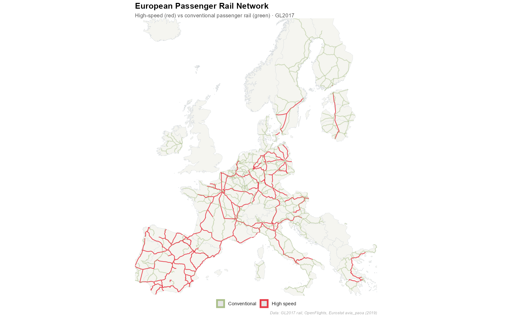
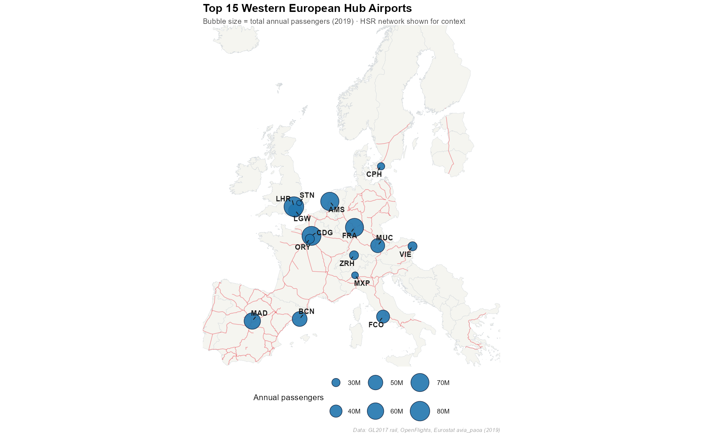
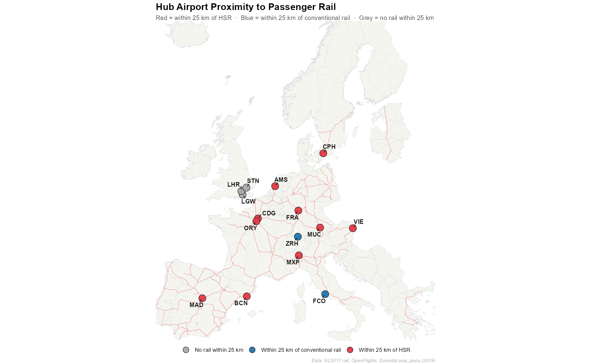
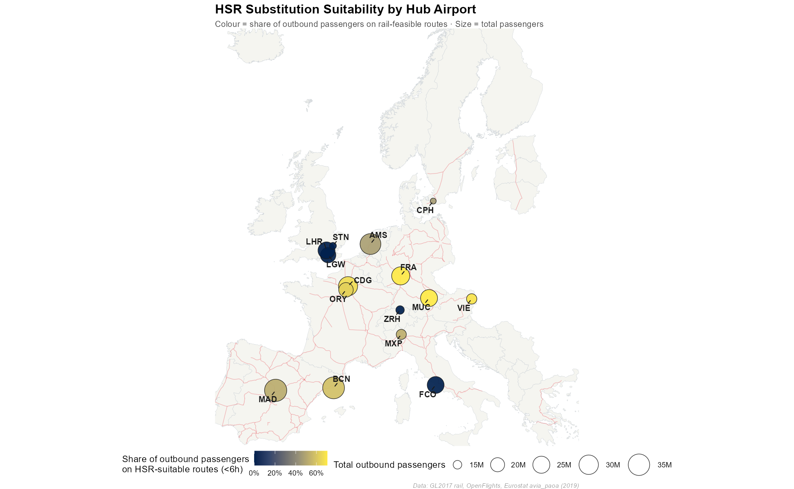
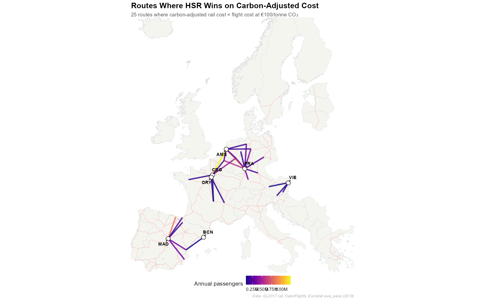
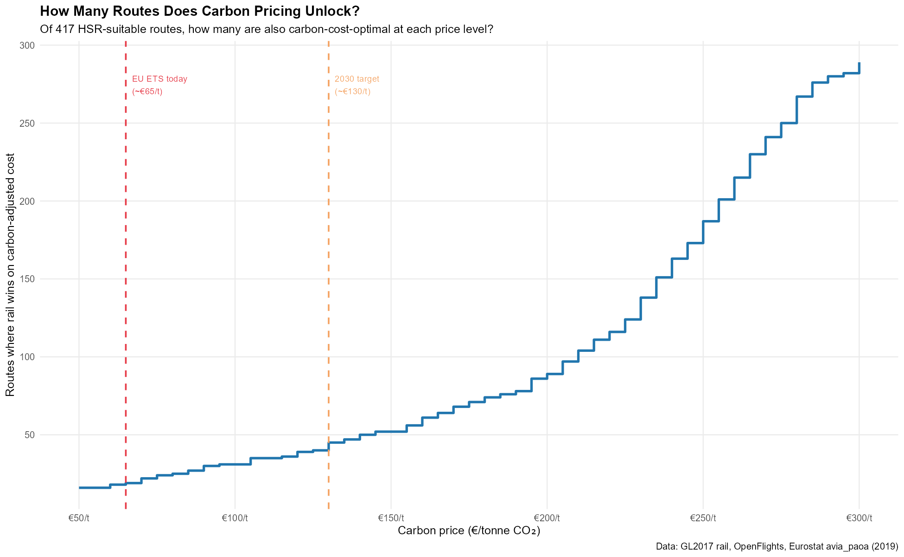

# HSR Substitution Suitability — Analysis Summary
**BSE GIS Final · 2025-2026**

---

## What We Did

We asked: **which short-haul European flights could realistically be replaced by high-speed rail, and under what conditions?**

Using spatial network analysis on 15 major western European hub airports, we:

- Mapped the GL2017 European passenger rail network and identified HSR corridors
- Scored each of the 15 airports by how close they sit to HSR infrastructure
- Flagged outbound routes as "HSR-suitable" if both endpoints are within 25 km of HSR and rail journey time is under 6 hours
- Applied a carbon-adjusted cost model (Allen & Arkolakis, 2014) to identify routes where rail wins outright
- Ran a carbon price sensitivity analysis to quantify how many more routes flip under the EU's 2030 targets

---

## Data Sources

- **Rail network:** GL2017 EU railway shapefile (3,361 segments, HSR flagged)
- **Airports:** OpenFlights `airports.txt` filtered to European commercial airports
- **Routes & passengers:** Eurostat `avia_paoa` (2019), joined via ICAO codes
- **Carbon parameters:** 255 g CO₂/pax-km (aviation, incl. radiative forcing), 14 g CO₂/pax-km (HSR)
- **Cost model:** Carbon price €100/tonne, value of time €30/hr → λ = 0.00333 hr/kg CO₂

---

## Map 1 — European Passenger Rail Network

**Key points:**
- Red = high-speed rail (GL2017 `TYPE == "High speed"`)
- Green = conventional passenger rail
- HSR is concentrated in France, Spain, Germany, and northern Italy
- UK fast lines are classified as conventional in GL2017 — a known data limitation
- The network forms a largely connected corridor accessible from most hub airports

---

## Map 2 — Top 15 Western European Hub Airports

**Key points:**
- Bubble size = total annual passengers (2019, Eurostat)
- LHR, CDG, and AMS are the three largest hubs by passenger volume
- All 15 airports are clustered in the western European core — the region with the densest HSR coverage
- Data: `03_top10_route_pairs.csv` contains the top 10 busiest specific routes by passenger count

---

## Map 3 — Airport Proximity to Rail Infrastructure

**Key points:**
- **Red** = within 25 km of an HSR segment (connector-feasible for substitution)
- **Blue** = within 25 km of conventional rail only
- **Grey** = no rail within 25 km
- Most hub airports sit close to the rail network — the infrastructure gap is smaller than expected
- LHR is the notable outlier: no HSR within the threshold, reflecting the absence of a direct airport-HSR link
- This 25 km threshold is a modelling assumption — see sensitivity analysis below

---

## Map 4 — HSR Substitution Suitability by Airport

**Key points:**
- Colour = share of outbound passengers on HSR-suitable routes (rail-connected, under 6h)
- Size = total outbound passengers
- **417 of 506 rail-connected routes** meet the 6-hour threshold
- Airports in central Europe (FRA, CDG, AMS) score highest — dense HSR networks with many short connections
- BCN scores lower not due to poor infrastructure, but because its route network skews longer than the carbon break-even
- Full airport-level scores: `05_airport_suitability.csv`

---

## Map 5 — Routes Where Rail Wins on Carbon-Adjusted Cost

**Key points:**
- Lines = routes where carbon-adjusted rail cost < flight cost at €100/tonne CO₂
- Coloured by annual passengers (brighter = more passengers)
- At baseline carbon price, **~25–35 routes** are strictly carbon-optimal
- These are concentrated in the France–Spain–Germany triangle where HSR speeds and coverage are highest
- Route-level detail: `08_carbon_optimal_routes.csv`
- Airport leaderboard: `09_airport_leaderboard.csv`

---

## Chart — Carbon Price Sensitivity

**Key points:**
- X axis = carbon price (€/tonne CO₂), Y axis = number of HSR-suitable routes where rail wins on cost
- **Red dashed line** = current EU ETS price (~€65/tonne)
- **Orange dashed line** = EU 2030 carbon price target (~€130/tonne)
- The step function shows routes flipping one by one as carbon price rises
- Moving from €65 → €130 unlocks a meaningful additional set of routes for several airports
- Raw data: `10_carbon_sensitivity_data.csv`

---

## Table — Carbon Price Impact by Airport (€65 → €130)

*(See `11_carbon_delta_65_130.csv`)*

**Key points:**
- FRA and CDG gain the most routes when carbon price doubles — central European hubs benefit most
- BCN gains 1 route (VLC, 85k passengers) at €130 — sits almost exactly at the break-even distance
- MAD gains routes due to its dense short-haul domestic network within Spain
- The passenger gains are uneven: airports with high-volume short routes (CDG) see large absolute gains

---

## Key Findings

1. **Infrastructure access, not distance, is the binding constraint.** LHR has zero HSR-suitable routes despite being Europe's busiest airport. CDG has 21. The difference is a rail station, not geography.

2. **At current carbon prices (~€65/t), only ~25 routes are strictly carbon-optimal.** The EU ETS as currently priced is insufficient to make rail economically dominant on most routes.

3. **The 2030 carbon target (~€130/t) meaningfully expands the carbon-optimal set**, particularly for central European hubs (FRA, CDG, AMS). Several routes sit just above the break-even and would flip with a moderate price increase.

4. **BCN is the most instructive case.** It is well-connected to HSR (3.4 km to nearest segment) and has many rail-feasible routes, but its network of destinations sits just above the carbon break-even. VLC at 296 km misses by under 0.01 cost units at €65 — a textbook example of a route that requires either higher carbon pricing or reduced airport friction to flip.

5. **Airport overhead is as important as carbon price.** The 0.75h flight overhead built into the model is the key asymmetry. Infrastructure investment reducing effective airport access time (e.g., direct HSR-airport integration) shifts the break-even distance more than a doubling of the carbon price.

---

## Limitations

| Assumption | Direction of bias |
|---|---|
| 25 km buffer as HSR access proxy | Overstates accessibility for some airports |
| Straight-line / HSR speed for rail time (no network routing) | Understates rail time for routes with transfers |
| 0.75h flat flight overhead | Understates airport friction → conservative on HSR competitiveness |
| 255 g CO₂/pax-km includes radiative forcing multiplier | Excluded from some policy frameworks — break-even ~60% higher without it |
| 2019 Eurostat passenger data | Pre-COVID; post-pandemic demand patterns differ |
| OpenFlights route data | May be incomplete; no frequency data |

---

*Analysis by: [your names here] · Tools: R (`sf`, `ggplot2`, `sfnetworks`, `dplyr`) · Framework: Allen & Arkolakis (2014)*
